---
hide:
    - navigation
---

# Reingegnerizzazione dei procedimenti :material-engine-outline:
Questa pagina focalizza l'attenzione sull'attività di riprogettazione, dei flussi di lavoro, che deve essere effettuata sia per la nuova gestione in modalità digitale dei procedimenti amministrativi, grazie all'uso di adeguati applicativi software, sia per migliorare le modalità di lavoro - in termini di efficienza - da parte del personale della PA e dell'utente (per i procedimenti attivati da istanza di parte) e per ridurre i tempi di processamento delle fasi operative.

## Cosa si intende per reingegnerizzazione dei procedimenti
La reingegnerizzazione è un attività di rivisitazione/riprogettazione del flusso di lavoro necessario alla gestione dei procedimenti amministrativi.

Il termine reingegnerizzazione va inteso come rivisitazione, ri-progettazione del flusso di lavoro, privilegiando la gestione efficace e cercando di evitare fasi ridondanti o addirittura inutili per il perfezionamento del procedimento.

!!! info inline end

    :man_raising_hand: **Definire le criticità**:
    
    - in che cosa consistono, 
    - come si manifestano, 
    - su quali fasi e attività del procedimento si concentrano, 
    - quali effetti producono.
    
La riprogettazione del procedimento amministrativo deve essere condotta attraverso un’analisi, che, scomponendo il procedimento nelle sue singole attività, sia in grado di mettere in luce le **criticità** per individuare e attivare specifiche **azioni correttive**.

La riprogettazione del procedimento deve migliorare l’efficienza del flusso di lavoro, efficienza intesa come rapporto tra **risorse impiegate** (umane, strumentali) e **risultati ottenuti** (qualità dei servizi pubblici erogati innanzitutto), con particolare attenzione all'utilizzo della risorsa **tempo**. 

Nei procedimenti amministrativi, l’efficacia va valutata in relazione alle aspettative e ai bisogni dell'utenza. Migliorare l’efficacia del processo significa migliorare la qualità del servizio reso (cioè rispondenza del servizio alle necessità dei fruitori). 

Nel caso di procedimento attivato da istanza di parte (richiesta di servizio dall'utente), il seguente diagramma aiuta a capire come intervenire per soddisfare le aspettative degli utenti: 

``` mermaid
flowchart TD
    A([richiesta servizio pubblico dall'utente]) --> B((percezione utente));
    B -->|negativa| C([analisi dei flussi procedimento per individuare criticità]);
    C -->|con feedback dell'utente dei servizi: customer satisfaction| D([riprogettazione flussi del procedimento]);
    D --> B;
    B ---->|positiva| E(["soddisfazione utente &#x263A;"]);
    style B fill:#f9f,stroke:#333,stroke-width:2px
```

## Reingegnerizzare partendo dagli utenti :fontawesome-regular-user:
Nella gestione dei procedimenti amministrativi propedeutici all'erogazione dei servizi pubblici all'utenza si definiscono nettamente 2 ruoli, che di seguito verranno ripresi diverse volte.

<kbd>**l'utente**</kbd>|<kbd>**la PA**</kbd>
------|--------
cittadino/a, impresa, associazione che 1) chiede un servizio alla PA e 2) attende un tempo x per l'ottenimento del servizio | personale della PA che lavora direttamente (a vario titolo) nella gestione dei procedimenti amministrativi per l'erogazione di un servizio pubblico

Nel caso di percezione dell'utente "negativa" del servizio pubblico reso, il personale delle PA responsabile della gestione del procedimento deve effettuare un analisi degli aspetti che caratterizzano le criticità, ed in questo può essere utile fare infadigini online di **`customer satisfaction`** con le quali - attraverso domande specifiche :fontawesome-regular-list-alt: - intercettare gli aspetti del processo di lavoro che debbono essere migliorati, al fine di assicurare all'utenza un servizio più vicino alle aspettative (ad esempio, aspetti su: accessibilità, interfaccia grafica, fasi operative da seguire sulla piattaforma informatica, modalità di pagamenti, modalità di comunicazione e di avvisi tra utente e PA, ecc.).

Di seguito un infografica della `scheda del servizio`, a cura del Dipartimento Trasformazione Digitale (Designers Italia) che aiuta a comprendere come costruire l'architettura dell'informazione, necessaria a strutturare anche le fasi di gestione del procedimento a cui è correlato il servizio da erogare.

<kbd>scheda del servizio da erogare a cui è legato un procedimento</kbd>

## Customer satisfaction :fontawesome-solid-street-view:

Nel box che segue viene elencato un set di domande minime da somministrare in un indagine online di `customer satisfaction` mirata ad individuare i gap riscontrati nella fase di richiesta e fruzione del servizio pubblico da parte dell'utente, con particolare riferimento ai servizi richiedibili ed ottenibili online attraverso le modalità più diffuse che  sono: applicativo gestionale del sito istituzionale - email - PEC. L'indagine dovrebbe essere somministrata come modulo da compilare online che genera automaticamente la compilazione di un database con le risposte fornite.

!!! Note "Set di domande minime da somministrare in un indagine di `customer satisfaction` :fontawesome-solid-street-view: "

    1. Quali servizi ti interessa maggiormente fruire nell'arco di un anno? 
        - edilizia privata   
        - servizi di sportello unico attività produttive
        - servizi cimiteriali
        - servizi sportivi
        - servizi sociali  
        - servizi scolastici
        - servizi culturali
        - altro servizio (`possibilità di inserire testo`)
    2. Con quale frequenza consulti il sito istituzionale per fruire servizi online? 
        - tutti i giorni 
        - uno o più volte a settimana 
        - uno o più volte al mese 
        - sporadicamente  
    3. Per accedere e fruire il servizio di tuo interesse oggi nel sito istituzionale trovi:
        - un apposito applicativo che ti consente di gestire la richiesta e l'ottenimento del servizio, al quale accedo con credenziali SPID|CIE|CNS
        - un email che trovi su una pagina del sito istituzionale e che utilizzi per effettuare la sola richiesta del servizio. Successivamente per ricevere il servizio mi devo recare in un ufficio fisicamente
        - un email che trovi su una pagina del sito istituzionale e che utilizzi per effettuare la richiesta e per ricevere il servizio richiesto
        - soltanto un indirizzo fisico dell'ufficio che devo raggiungere anche per la fase di richiesta del servizio
    4. Se fruisci il servizio tramite applicativo online, riesci a individuare e seguire con facilità le funzioni dell'applicativo per completare la procedura che ti consente di richiedere e fruire del servizio online di cui hai bisogno?
        - si abbastanza bene
        - riesco a completare le azioni richieste dall'applicativo ma con qualche difficoltà 
        - ho enormi difficoltà e non riesco a completare la procedura per richiedere e fruire il servizio online di mio interesse, mi comporta perdita di tempo per capire la sequenza logica delle azioni da compiere per completare la procedura di richiesta o ricezione del servizio di mio interesse
    5. In un applicativo che stai utilizzando online, ti viene richiesto di inserire dati che già potrebbero essere in possesso del Comune (ad es. nome, cognome, residenza, data nascita, codice ficale, ecc.)?
        - si
        - no
        - si a volte nell'applicativo relativo al servizio denominato "......" (`possibilità di inserire testo`)   
    6. Quando devi pagare per fruire di un servizio pubblico richiesto, quale delle seguenti modalità adotti?
        - pagoPA, perchè nell'applicativo presente sul sito istituzionale è prevista questa modalità di pagamento specifica
        - bonifico bancario perchè nell'applicativo presente sul sito istituzionale è prevista questa modalità di pagamento specifica e l'indicazione dell'IBAN e della causale
        - bollettino postale, perchè sul sito istituzionale è prevista questa modalità di pagamento specifica o perchè via email/telefono mi è stata comunicata questa modalità
        - bancomat nella postazione fisica in cui fruisco il servizio
        - contanti nella postazione fisica in cui fruisco il servizio
    7. Se fruisci il servizio tramite applicativo online cosa aggiungeresti come funzioni per facilitare la fase di richiesta e di ottenimento del servizio di tuo interesse?
        - descrivi cosa inseriresti (`possibilità di inserire testo`)       
    8. Se fruisci il servizio tramite applicativo online cosa elimineresti dall'attuale procedura er facilitare la fase di richiesta e di ottenimento del servizio di tuo interesse?
        - descrivi cosa elimineresti (`possibilità di inserire testo`)       
    9. Quali servizi online aggiungeresti da fruire tramite applicativo specifico nel sito istituzionale del Comune, che ad oggi non trovi?
        - descrivi il nome del servizio (`possibilità di inserire testo`) 

Con la customer satisfaction si raccolgono anche dati che aiutano a comprendere i profili di utilizzatori dei servizi pubblici.
 
!!! Note "Dati statistici da richiedere al compilatore dell'indagine di customer satisfaction nello stesso modulo :material-card-account-details: "
 
    1. Fascia di età:
        - 18-30
        - 30-45
        - 45-60
        - 60-oltre
    2. Sesso
        - M
        - F
    3. Livello istruzione
        - scuola media
        - diploma scuola secondo grado
        - laurea o titolo equivalente
    4. Posizione lavorativa:
        - inoccupato/a
        - dipendente pubblica amministrazione
        - impiegato/a in aziende del settore privato
        - libero/a professionista 
    5. Residenza
        - residente nel comune di Palermo
        - non residente nel comune di Palermo
    6. Possesso di identità digitale (dall'ottobre 2021 è necessaria per accedere ai servizi online della pubblica amministrazione italiana)
        - SPID
        - CIE
        - CNS
        - ad oggi non possiedo nessuna delle 3 identità digitali sopra elencate

Con i dati dell'indagine raccolti si avvia l'attività di analisi per comprendere gli aspetti critici e concentrarsi sulla riprogettazione del flusso di lavoro che caratterizza la gestione del procedimento in esame.

## Analisi per la reingegnerizzazione :material-check-underline:
Viene effettuata un **analisi** dei procedimenti per verificare la modalità di gestione delle azioni condotte in un flusso lavorativo. L'analisi ha come obiettivo:

- l'eliminazione delle azioni ritenute ridondanti o addirittura inutili e che causano di perdita di tempo, senza generare alcun vantaggio nè per il personale della PA nè per l'utenza dei servizi pubblici;
- la riduzione dei tempi di processamento delle singole attività lavorative;
- il miglioramento dell'efficienza nella gestione delle fasi di lavoro dei procedimenti;
- il miglioramento della qualità dell'esperienza di lavoro quotidiano del dipendente pubblico;
- il miglioramento della qualità dei servizi pubblici erogati all'utenza e collegati ai procedimenti gestiti negli uffici, e misurati con il livello di qualità percepita (rilevata con indagini di customer satisfation).

## Report dell'analisi: diagnosi :material-google-analytics:
A seguito dell'**analisi dei procedimenti** si produce un report di **diagnosi** che evidenzia: 

1. punti di forza :material-plus:
2. criticità da mitigare per ogni procedimento :material-minus:  

Il report di diagnosi contiene anche le **proposte di rivisitazione** delle fasi di lavoro per la gestione del procedimento amministrativo in una nuova modalità. Il report di diagnosi viene reso disponibile come documentazione necessaria all'adozione futura di applicativi informatici per la gestione del procedimento amministrativo in modalità digitale.

Un applicativo gestionale deve poter offrire la possibilità alla pubblica amministrazione di modificare i flussi di lavoro del procedimento amministrativo, senza ricorrere ogni volta all'intervento della software house per gli sviluppi. Per esempio aggiugere e togliere: **funzioni**, **moduli** e **metadati**. Un sistema informatico che sia modulare e adattabile alle esigenze di trattamento ed evoluzione gestionale del procedimento, senza fare ogni volta risorso alla software house per le implementazioni. Questo "requisito" dovrebbe essere rappresentato nelle caratteristiche richieste dalle pubbliche amministrazioni nei capitolati tecnici per la fornitura di software gestionale dei procedimenti.

## Reingegnerizzare attraverso lo strumento del "BPM"
 </img> <kbd>immagine del FormezPA</kbd>

Il BPM è l'acronimo di [**Businees Process Management**](https://it.wikipedia.org/wiki/Business_process_management). E' una tecnica che nasce per le aziende private, e, nel caso di una pubblica amministrazione, può servire a definire, ottimizzare, monitorare ed integrare i processi amministrativi, al fine di rendere efficaci i servizi all'utenza. E' sicuramente utile conoscere questa tecnica nell'attività di reingegnerizzazione dei procedimenti.

Il BPM si avvale di software che permette di ricevere in ingresso dati|informazioni, analizzarli e costruire flussi di lavoro in base alle "esigenze" degli addetti ai lavori. Gli addetti ai lavoro sono: 1) responsabili e addetti al procedimento nella PA e 2) utenti del servizio pubblico correlato al procedimento. Nelle "esigenze" rientrano:
 
- le norme vigenti da rispettare per la gestione di un procedimento e l'erogazione di un servizio pubblico;
- i tempi da rispettare (pevisti dalle norme) per la gestione di un procedimento e l'erogazione di un servizio pubblico;
- le fasi operative proprie di ogni procedimento;
- i metadati propri di ogni procedimento;
- le richieste degli utenti, raccolte e mappate attraverso momenti di ascolto (incontri di personale della PA e cittadini) e indagini di customer satisfaction;
- le regole tecniche previste dalle [linee guida attuative del CAD](https://uo-transizionedigitalecomunepalermo.github.io/mappatura-procedimenti-amministrativi/contenuti/linkografia/) :octicons-link-external-16: .

È consigliabile sperimentare la reingegnerizzazione partendo da piccole porzioni dell'Ente, concentrando il lavoro sugli attori coinvolti in singolo procedimento specifico, così da verificare i risultati della sperimentazione e successivamente estendere il metodo all'intero sistema dei procedimenti dell'Ente. 

## Richieste di servizi più efficienti dalla collettività :fontawesome-solid-users:
Oggi cittadini, imprese e associazioni richiedono servizi pubblici sempre più efficienti ed in modalità digitale e online, senza essere ostaggio di inutili perdite di tempo agli sportelli fisici. A questo fabbisogno della colletività deve seguire un "aggiornamento" del prezioso sistema dei metadati e delle fasi operative di lavoro per la gestione del procedimento. 

> [*I cittadini si aspettano*](https://docs.italia.it/italia/designers-italia/design-comuni-docs/it/stabile/principi-guida-lanalisi-dei-risultati-della-ricerca/priorit%C3%A0-e-bisogni.html):
> 
> - *una maggiore proattività da parte del comune nel proporre informazioni puntuali e personalizzate, servizi correlati e notifiche automatizzate;* 
> - *un maggior numero di pratiche gestibili online per garantire una gestione migliore dei tempi allo sportello, trasformando lo sportello in un servizio di assistenza e consulenza vera e propria;* 
> - *una semplificazione non solo delle procedure, ma anche del linguaggio burocratico, che permetta di essere autonomi da intermediari e consulenti nella gestione di pratiche al momento non completamente accessibili;* 
> - *una comunicazione aggiornata e trasparente;* 
> - *integrazione e scambio di dati tra più enti, evitando di ripetere le stesse procedure e di inserire informazioni già note.*
>
> (A cura di Designers Italia)

Nella PA è difficile individuare e reingegnerizzare processi di lavoro, in quanto c'è la tendenza culturale generalizzata a privilegiare la "conformità alle norme" anzichè privilegiare l’"efficacia" e l’"efficienza operativa". 
Non viene dedicato il tempo e l'attenzione necessaria all’utente, preferendo il rispetto di esigenze organizzative interne. Il principale errore delle pubbliche amministrazioni consiste nell'essere autoreferenziali e nel non orientare la propria azione amministrativa a servizio del cittadino. Ancora oggi molte PA programmano la gestione dei servizi facendo riferimento a *Organigrammi/Uffici/Dirigenti* e non alla soddisfazione dell'utente nella fruizione di un servizio pubblico.

Per invertire questa vecchia tendenza, un aspetto su cui focalizzare l'attenzione è la **qualità dell'esperienza utente** nella fruizione dei servizi pubblici online, e di conseguenza all'utilizzo dell'applicativo informatico nelle fasi di:

1. gestione delle funzioni operative dell'interfaccia grafica da parte del personale delle pubbliche amministrazioni (`back end`)
2. gestione delle funzioni operative dell'interfaccia grafica da parte degli utenti che richiedono ed ottengono un servizio in modalità totalmente digitale online (`front end`).

## Esperienza Utente (UX) :face_with_raised_eyebrow:  e Interfaccia Utente (UI) :material-monitor-dashboard: 
La **User Experience** UX (esperienza utente) è strettamente legata alla **User Interface** UI (interfaccia utente). Interfaccie semplici e intuitive dei software generano facilità d'uso e soddisfazione nella fase di utilizzo. Questo ha la medesima valenza per il personale della pubblica amministrazione e per gli utenti dei servizi.  Ambedue le categorie sono persone, anche se sono posizionati in due punti diversi dell'applicativo:

- **`back end`** = tutte le funzioni che vede, consulta e gestisce il personale della PA (in ufficio o da remoto in lavoro agile)
- **`front end`** = tutte le funzioni che vede, consulta e con le quali interagisce l'utente da casa

Utenti dei servizi pubblici e personale della PA hanno entrambi la stessa esigenza|aspettativa di interagire con interfaccie grafiche software di semplice intuizione, che si adattaono a qualsiasi dimensione di dispaly (laptop, tablet, smartphone, pc desktop). 

## Il linguaggio da usare per le interfacce grafiche della PA
Anche il linguaggio da usare nelle interfacce grafiche riveste una grande importanza per il personale della PA e per gli utenti dei servizi pubblici.

!!! Note "Guida al linguaggio della Pubblica Amministrazione"
    
    
    
    Nel linguaggio da usare nelle interfacce grafiche degli applicativi per gestire procedimenti e servizi pubblici online bisogna seguire le indicazioni della [**`Guida al linguaggio della Pubblica Amministrazione`**](https://docs.italia.it/italia/designers-italia/writing-toolkit/it/bozza/index.html) (a cura di AGID + Team Digitale) al fine di rendere semplici e intuitive le istruzioni che l'utente e l'operatore della PA deve seguire per richiedere|ottenere un servizio (front end) e per gestire il procedimento (back end).
    
    Vedi anche il [**Kit "Contenuti e linguaggio"**](https://designers.italia.it/kit/contenuti-linguaggio/) curato dal Dipartimento Trasformazione digitale.

## Architettura delle informazioni nella gestione di servizi e procedimenti :material-table-sync:
> *[L’architettura dell’informazione](https://docs.italia.it/italia/designers-italia/design-linee-guida-docs/it/stabile/doc/content-design/architettura-dell-informazione.html) consiste nell’organizzazione semantica e logica di ambienti informativi, sia fisici sia digitali, e serve a rendere i servizi pubblici più facili da trovare, da capire e da usare. Una buona architettura dell’informazione aiuta le persone a comprendere ciò che le circonda e a trovare ciò che cercano, sia online che offline. Lavorare su questo ambito implica una riflessione sulla struttura dell’informazione e sul linguaggio*. 
> 
> (A cura di Designers Italia).

<kbd>Focus sui servizi al cittadino a cui è legato un procedimento</kbd>

*[La fruizione dei servizi deve seguire un flusso standard](https://docs.italia.it/italia/designers-italia/design-comuni-docs/it/stabile/il-modello/architettura-dellinformazione.html#flusso-accesso), a partire dalla struttura delle informazioni fino all’integrazione di componenti di autenticazione (Spid) e del sistema di pagamento (pagoPA)* 

!!! Note "Video tutorial e materiali utili su `progettare e realizzare il sito web di un Comune`"
    
    - [Link alla playlist di Youtube](https://www.youtube.com/playlist?list=PLd5bJJul8c5phEjmNKgPK2dCwZGCSqzsq) a cura del FormezPA.
    - [Link ai meteriali](http://eventipa.formez.it/node/328513) a cura del FormezPA.

I software sono gli strumenti per permettere a chiunque (personale della PA e cittadini) di lavorare per gestire tutte le fasi che caratterizzano l'attività di competenza delle istituzioni pubbliche. Tutti i servizi pubblici sono correlati a procedimenti amministrativi, e per tale ragione il software gestionale deve assicurare a chiunque di poter fare le cose in maniera facile, intuitiva e agevole, senza incorrere in problemi di accessibilità o di interpretazione delle funzioni operative (relative alle interfaccie grafiche) o del linguaggio adottato. A tal riguardo l'[**`architettura dell'informazione`**](https://designers.italia.it/kit/architettura-informazione/) va curata nella fase di progettazione degli applicativi per la gestione dei procedimenti e per l'erogazione dei servizi all'utenza. 

Nell'architettura dell'informazione va curata l'organizzazione dei contenuti per i servizi da erogare.

!!! Info "Organizzazione dei contenuti per i servizi, con la tecnica del [`card-sorting`](https://designers.italia.it/kit/architettura-informazione/) (ordinamento delle carte)" 
    <kbd>A cura del Dipartimento Trasformazione Digitale (Designers Italia)</kbd>
    
    ↓
    
    
    

## Funzioni minime di un applicativo per gestire procedimenti legati a servizi :material-order-bool-ascending-variant:
Di seguito viene elencato un set di funzioni minime di un applicativo che gestisce procedimenti correlati a servizi pubblici. Funzioni da intendersi come "`requisiti minimi`" da chiedere al mercato software (o individuare nel [**catalogo del riuso applicativo**](https://developers.italia.it/it/software.html)) da parte della PA e da includere in capitolati tecnici.

1. interfaccia grafica che adotta il `Material design` e conforme alle [**Linee guida AGID**](https://uo-transizionedigitalecomunepalermo.github.io/mappatura-procedimenti-amministrativi/contenuti/linkografia/)
2. accesso dell'utente (cittadino, impresa, associazione) esclusivamente con identità digitale SPID|CIE|CNS 
3. accesso del dipendente della PA con credenziali nel breve periodo e con identità digitale SPID|CIE|CNS a regime nel medio lungo termine 
4. funzioni operative che danno la possibilità all'utente di visualizzare in qualsiasi momento lo stato di avanzamento dell'istruttoria relativa al rilascio del servizio richiesto 
5. funzioni operative che danno la possibilità all'utente di inviare comunicazioni al personale della PA per chiarimenti o integrazioni documentali, con generazione automatica di email all'utente (avviso) 
6. funzioni operative che danno la possibilità al personale della PA di inviare comunicazioni all'utente per chiarimenti o integrazioni documentali, con generazione automatica di avviso sull'applicativo per il personale della PA 
7. funzioni operative che danno la possibilità di generare automaticamente email all'utente (avviso) quando l'istruttoria del servizio richiesto (lato back end) è conclusa ed è stato generato il documento informatico da fornire all'utente all'interno dell'applicativo stesso 
8. agganciamento, tramite API, all'app di Stato denominata [**IO**](https://io.italia.it/), in maniera tale da erogare il servizio anche attraverso tale app 
9. pagamento di quanto dovuto alla PA per la fruizione del servizio pubblico, tramite [**PagoPA**](https://www.pagopa.gov.it/), e riconciliazione automatica del pagamento nel database correlato all'aplicativo utilizzato 
10. interoperabilità applicativa, tramite [**API**](https://docs.italia.it/italia/piano-triennale-ict/pianotriennale-ict-doc/it/2020-2022/capitolo_5_interoperabilit%C3%A0.html?highlight=api), con altre piattaforme di servizi pubblici o altre banche dati pubbliche, al fine di completare il ciclo di vita del procedimento nel più breve tempo possibile e senza chiedere all'utente documentazione e dati già in possesso della stessa o di altre PA 
11. interoperabilità con l'applicativo del protocollo informatico dell'ente per la protocollazione, metadatazione del documento informatico generato e suo inserimento nel fascicolo pertinente, nonchè conservazione a norma 
12. editor di testo (all'interno dello stesso applicativo) per la generazione di comunicazioni bidirezionali (utenza --> personale PA | personale PA --> utenza) e per la formazione del documento amministrativo da firmare, protocollare e consegnare all'utente  
13. firma digitale da apporre nel documento generato, da parte del dirigente o funzionario preposto alla fine del flusso relativo all'istruttoria del procedimento (questo evita di far entrare il personale preposto alla firma in un altro ambiente software per la firma digitale) 
14. possibilità di generare report in qualsiasi momento su dati presenti nel database correlato, ad es. quantità di procedimenti avviati, conclusi e relativi stati di avanzamento, tempi di processamento, info sull'identità dei responsabili dell'istruttoria, ecc. Report da generare sotto forma di infografiche e data visualization all'interno dello stesso applicativo e anche attraverso la generazione di formati dati `CSV` o `PDF` da esportare (download)
15. possibilità per il personale della PA (in particolare per il responsabile del sistema di gestione documentale) di poter modificare|implementare la classe dei metadati dell'applicativo che gestisce il procedimento. Per questa operazione il personale della PA deve poter operare in piena autonomia (attraverso l'uso di apposite credenziali) senza fare ricorso alla software house che ha generato l'applicativo gestionale.

Questi sopra elencati rappresentano i requisiti minimi che dal 2022 **devono** essere presenti in un applicativo informatico che gestisce procedimenti correlati a servizi pubblici, al fine di rispettare i contenuti del [**Piano triennale per l'Informatica**](https://docs.italia.it/italia/piano-triennale-ict/pianotriennale-ict-doc/it/2020-2022/index.html) redatto dall'AGID e attuativo del [**Codice dell'Amministrazione Digitale**](https://docs.italia.it/italia/piano-triennale-ict/codice-amministrazione-digitale-docs/it/v2021-07-30/index.html).

## Linee guida di design per i servizi digitali della PA :material-devices: 
Al fine di rendere le interfaccie grafiche quanto più semplici possibili per la consultazione da parte degli utenti sono state pubblicate da AGID le [**Linee guida di design per i servizi digitali della PA**](https://docs.italia.it/italia/designers-italia/design-linee-guida-docs/it/stabile/index.html) che rappresentano uno strumento di lavoro per la Pubblica Amministrazione (e loro fornitori), *e servono ad orientare la progettazione di ambienti digitali fornendo indicazioni relative al service design (progettazione dei servizi), al content design (progettazione dei contenuti), alla user research (ricerca con gli utenti), e alla user interface (interfaccia utente)*.

Le Linee guida di design per i servizi digitali della PA adottano l’approccio [**`human-centered`**](https://docs.italia.it/italia/designers-italia/design-linee-guida-docs/it/stabile/doc/user-research/usabilita.html#user-centered-design) :fontawesome-solid-street-view: con i seguenti obiettivi:

 - coinvolgere cittadini e operatori in ogni momento del percorso progettuale, per capire le loro necessità, generare idee e validare le scelte progettuali in corso d’opera;
 - modellare i servizi digitali sulla base di esigenze concrete e risorse esistenti evitando sprechi, duplicazione di attività e creando servizi utili; 
 - disegnare e sviluppare flussi di interazione chiari, che rispondano con efficacia alle necessità dei diversi utenti, generando un’esperienza d’uso positiva; 
 - strutturare i contenuti in modo semplice, con uno stile comunicativo coerente e una strategia editoriale sostenibile nel tempo.

> *Lo [`user centered design`](https://docs.italia.it/italia/designers-italia/design-linee-guida-docs/it/stabile/doc/user-research/usabilita.html#user-centered-design) è un insieme di tecniche usate per far emergere i bisogni effettivi delle persone per cui si sta progettando un contenuto, coinvolgendo le persone stesse nel processo di progettazione. Per «persone» si intendono tutti i portatori di interesse (stakeholder) del progetto. Nel caso della pubblica amministrazione*:
>    
> - *Cittadini*; 
> - *Aziende*; 
> - *Dipendenti di altre amministrazioni o istituzioni*; 
> - *Committenti*.
>
> (A cura di Designers Italia)

---

!!! Info "Immagini" 
    Le immagini utilizzate in questa pagina sono state rilasciate: 
    
    - alcune con licenza CC0, 
    - altre con [licenza CC-BY 3.0](https://www.governo.it/note-legali) dal Dipartimento Trasformazione Digitale (vedi paragrafo copyright), 
    - altre con licenza CC BY-SA 3.0 IT dal [FormezPA](http://eventipa.formez.it/node/328513) (vedi footer).

<!--
!!! Note "Credits"
    Per la redazione di questa pagina si è fatto riferimento anche alle seguenti fonti: 
    
    - Comune di Pisa [https://www.comune.pisa.it/sites/default/files/2018_05_17_17_36_10.pdf](https://www.comune.pisa.it/sites/default/files/2018_05_17_17_36_10.pdf) 
 -->  
