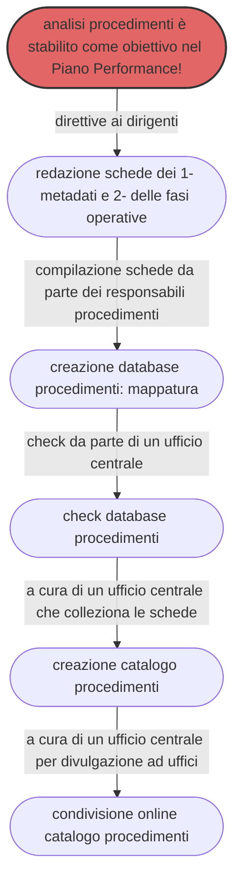

---
hide:
  - navigation
  - toc
---

# Procedimenti amministrativi per la digitalizzazione

## Cosa è questo progetto di documentazione
Questo progetto di documentazione ha lo scopo di illustrare un metodo e un set di strumenti semplici per avviare la mappatura e analisi dei **procedimenti amministrativi** gestiti da una Pubblica Amministrazione locale, con particolare riferimento all’ente "**Comune**".

Realizzare un’analisi dei procedimenti in ottica di **semplificazione**, al fine di creare le pre-condizioni per la **reingegnerizzazione** degli stessi e la relativa **digitalizzazione**.

Il documento è stato progettato seguendo il percorso operativo condotto dall’**Amministrazione comunale di Palermo**, impegnata da anni nella transizione alla modalità digitale, come prevista dal [Codice dell’Amministrazione Digitale](https://docs.italia.it/italia/piano-triennale-ict/codice-amministrazione-digitale-docs/it/v2021-07-30/index.html) (decreto legislativo n. 82/2005 e successive modifiche). 

Vengono descritte le azioni realizzate dal personale comunale, che hanno portato alla redazione di un <b>catalogo</b> contenente le **`fasi operative`** e i **`metadati`** dei procedimenti. E' stato tracciato un passo importante dal Comune di Palermo, necessario alla corretta digitalizzazione dei procedimenti amministrativi.

Il **processo di lavoro**, svolto in ordine temporale, è raffigurabile nel seguente schema:

original = style A fill:#f9f,stroke:#333,stroke-width:2px
