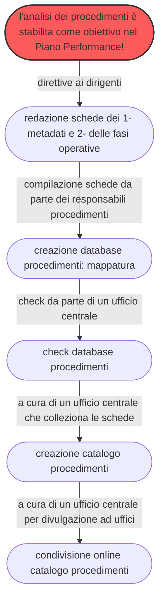

---
hide:
  - navigation
  - toc
---

# Procedimenti amministrativi per la digitalizzazione

## Cosa è questo progetto di documentazione :material-file-document-multiple-outline:
Questo progetto di documentazione ha lo scopo di illustrare un metodo e un set di strumenti semplici per avviare la mappatura e analisi dei **procedimenti amministrativi** gestiti da una Pubblica Amministrazione locale, con particolare riferimento all’ente "**Comune**".

Realizzare un’analisi dei procedimenti in ottica di **semplificazione**, al fine di creare le pre-condizioni per la **reingegnerizzazione** degli stessi e la relativa **digitalizzazione** :octicons-device-desktop-16: .

Questa guida è stata progettata seguendo il percorso operativo condotto dall’**Amministrazione comunale di Palermo**, impegnata da anni nella transizione alla modalità digitale, come prevista dal [Codice dell’Amministrazione Digitale](https://docs.italia.it/italia/piano-triennale-ict/codice-amministrazione-digitale-docs/it/v2021-07-30/index.html) (decreto legislativo n. 82/2005 e successive modifiche). 

Vengono descritte le azioni realizzate dal personale comunale, che hanno portato alla redazione di un <b>catalogo</b> contenente le **`fasi operative`** e i **`metadati`** dei procedimenti, tracciando un passo importante per il Comune di Palermo, necessario alla corretta digitalizzazione dei procedimenti amministrativi.

Il **processo di lavoro** :material-transit-connection-variant: - svolto in ordine temporale - è raffigurato nel seguente schema:

<!-- era fill:#f9f -->

## Destinatari del progetto :material-target-account:
I destinatari dei contenuti del progetto sono dirigenti, dipendenti e amministratori politici delle amministrazioni comunali.

I comuni sono tra i maggiori erogatori di servizi pubblici sul territorio a livello locale, e per tale motivo sono tenuti a gestire un numero elevato di procedimenti amministrativi correlati agli stessi servizi. 

Questo progetto si pone l'obiettivo di facilitare :material-hand-extended: e documentare :material-file-document-outline: il percorso operativo che il personale delle amministrazioni comunali deve avviare e condurre per la digitalizzazione dei servizi e dei relativi procedimenti.

## Forum per l'interazione e la propositività :octicons-comment-discussion-16:
Nella fase di creazione di questo documento abbiamo pensato che interagire e confrontarsi con altre persone (colleghe/i di altre Pubbliche Amministrazioni e non) sia una delle cose più importanti da fare se si vuole migliorare costanetemente il modo di lavorare negli uffici pubblici. 

A tal proposito è stato predisposto un apposito [**`Forum`**](https://github.com/UO-TransizioneDigitaleComunePalermo/mappatura-procedimenti-amministrativi/discussions) :material-forum-outline: sulla piattaforma GitHub :material-github:, che ospita il codice sorgente di questo progetto di documentazione, nel quale è possibile fare domande, ma anche proporre idee e miglioramenti al flusso di lavoro per la mappatura e analisi dei procedimenti amministrativi. Un luogo di interazione. 

[Vai al forum :material-forum:](https://github.com/UO-TransizioneDigitaleComunePalermo/mappatura-procedimenti-amministrativi/discussions){ .md-button .md-button--primary }

## Contenuti del progetto :fontawesome-solid-sitemap:

<pre>
<a href="https://uo-transizionedigitalecomunepalermo.github.io/mappatura-procedimenti-amministrativi/" target="_self"><b>Home</b></a>
├─ Focus giuridico &#8595; 
|  ├─ <a href="https://uo-transizionedigitalecomunepalermo.github.io/mappatura-procedimenti-amministrativi/contenuti/focus-giuridico/" target="_self">Focus giuridico</a>
|  └─ <a href="https://uo-transizionedigitalecomunepalermo.github.io/mappatura-procedimenti-amministrativi/contenuti/cad/" target="_self">I procedimenti visti dal "CAD"</a>
├─ Mappatura &#8595;
|  ├─ <a href="https://uo-transizionedigitalecomunepalermo.github.io/mappatura-procedimenti-amministrativi/contenuti/digitalizzazione-ambito-comunale/" target="_self">Percorsi di digitalizzazione in ambito comuale</a>
|  └─ <a href="https://uo-transizionedigitalecomunepalermo.github.io/mappatura-procedimenti-amministrativi/contenuti/esperienza-analisi/" target="_self">L'analisi dei procedimenti nel Piano della Performance</a>
├─ Metadati &#8595;
|  ├─ <a href="https://uo-transizionedigitalecomunepalermo.github.io/mappatura-procedimenti-amministrativi/contenuti/metadati/" target="_self">I metadati nella mappatura dei procedimenti</a>
|  ├─ <a href="https://uo-transizionedigitalecomunepalermo.github.io/mappatura-procedimenti-amministrativi/contenuti/metadati-determinazione-deliberazione/" target="_self">Metadati di determinazioni e deliberazioni</a>
|  ├─ <a href="https://uo-transizionedigitalecomunepalermo.github.io/mappatura-procedimenti-amministrativi/contenuti/schema-metadati/" target="_self">Schema di metadati per mappatura dei procedimenti</a>
|  └─ <a href="https://uo-transizionedigitalecomunepalermo.github.io/mappatura-procedimenti-amministrativi/contenuti/esperienza-metadatazione/" target="_self">Esperienza di mappatura con metadati</a>   
├─ <a href="https://uo-transizionedigitalecomunepalermo.github.io/mappatura-procedimenti-amministrativi/contenuti/fasi-operative/" target="_self">Fasi operative</a>
├─ <a href="https://uo-transizionedigitalecomunepalermo.github.io/mappatura-procedimenti-amministrativi/contenuti/reingegnerizzazione/" target="_self">Reingegnerizzazione</a>
├─ <a href="https://uo-transizionedigitalecomunepalermo.github.io/mappatura-procedimenti-amministrativi/contenuti/catalogo/" target="_self">Catalogo</a>
├─ <a href="https://uo-transizionedigitalecomunepalermo.github.io/mappatura-procedimenti-amministrativi/contenuti/linkografia/" target="_self">Linkografia</a>
├─ <a href="https://uo-transizionedigitalecomunepalermo.github.io/mappatura-procedimenti-amministrativi/contenuti/redazione/" target="_self">Redazione</a>
├─ <a href="https://uo-transizionedigitalecomunepalermo.github.io/mappatura-procedimenti-amministrativi/contenuti/strumenti/" target="_self">Strumenti | Licenza</a>
└─ <a href="https://github.com/UO-TransizioneDigitaleComunePalermo/mappatura-procedimenti-amministrativi/discussions" target="_self">Forum</a>
-  <a href="https://uo-transizionedigitalecomunepalermo.github.io/mappatura-procedimenti-amministrativi/site-map/" target="_blank">Site map</a>
-  <a href="https://uo-transizionedigitalecomunepalermo.github.io/mappatura-procedimenti-amministrativi/privacy/" target="_blank">Privacy-cookies</a>
</pre>    

