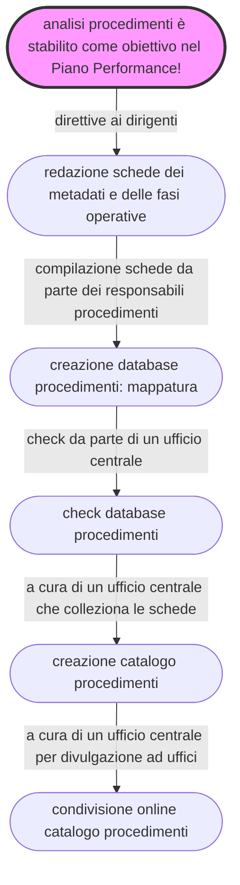

# L’analisi dei procedimenti amministrativi per la digitalizzazione in un Ente Locale 

## Cosa è questo progetto di documentazione
Questo progetto di documentazione ha lo scopo di illustrare un metodo e un set di strumenti semplici per avviare la mappatura e analisi dei **procedimenti amministrativi** gestiti da una Pubblica Amministrazione locale, con particolare riferimento all’ente "**Comune**".

Realizzare un’analisi dei procedimenti in ottica di **semplificazione**, al fine di creare le pre-condizioni per la **reingegnerizzazione** degli stessi e la relativa **digitalizzazione**.

Il documento è stato progettato seguendo il percorso operativo condotto dall’**Amministrazione comunale di Palermo**, impegnata da anni nella transizione alla modalità digitale, come prevista dal [Codice dell’Amministrazione Digitale](https://docs.italia.it/italia/piano-triennale-ict/codice-amministrazione-digitale-docs/it/v2021-07-30/index.html) (decreto legislativo n. 82/2005 e successive modifiche). 

Vengono descritte le azioni realizzate dal personale comunale, che hanno portato alla redazione di un <b>catalogo</b> contenente le **`fasi operative`** e i **`metadati`** dei procedimenti. E' stato tracciato un passo importante dal Comune di Palermo, necessario alla corretta digitalizzazione dei procedimenti amministrativi.

Il processo di lavoro, svolto in ordine temporale, è raffigurabile nel seguente schema:

---

## Come è costruito questo progetto di documentazione 

 Il progetto di documentazione è stato creato con lo strumento [**Material for MKDocs**](https://squidfunk.github.io/mkdocs-material/)

 Le pagine per inserire contenuti vengono redatte utilizzando il linguaggio **MarkDown**

 Le pagine di questo progetto di documentazione vengono compilate su [**GitHub gh-pages**](https://squidfunk.github.io/mkdocs-material/publishing-your-site/#with-github-actions)

 Il link al codice sorgente di questo progetto è su [**GitHub**](https://github.com/uo-transizionedigitalecomunepalermo/mappatura-procedimenti-amministrativi)

??? Note "Altri strumenti utilizzati per arricchire l'esperienza di fruzione dei contenuti di questo progetto"

    -  [**Addthis**](https://www.addthis.com/) per la condivisione sui social, e stampa pagine del progetto. Loghi social visualizzabili nella parte destra della pagina web su desktop e in basso su dispsitivi mobile. Il codice di Addthis si inserisce nel file `main.html` che si trova al seguente percorso `mkdocs-style/docs/overrides/main.html`
    -  [**Disqus**](https://disqus.com/) per permettere di inserire commenti in ogni singola pagina, tranne nell'home page. L'istruzione per inserire il codice di Disqus viene data nel file `mkdocs.yml` 
    -  [**Strumento di generazione dei contenuti del progetto in formato PDF**](https://cirospat.github.io/cirospataro/print_page/), indicato in ogni pagina con l'icona della stampante posizionato in alto a destra. Cliccando sull'icona è possibile generare una pagina html che contiene tutte le pagine del progetto di documentazione, eventualmente da stampare.

---

## I contenuti di questo progetto sono rilasciati rilasciati con licenza aperta 

I contenuti di questo progetto di documentazione sono rilasciati con licenza aperta [**Creative Commons CC BY 4.0 Int**](https://creativecommons.org/licenses/by/4.0/deed.it).

**Tu sei libero di**:

- Condividere — riprodurre, distribuire, comunicare al pubblico, esporre in pubblico, rappresentare, eseguire e recitare questo materiale con qualsiasi mezzo e formato 
- Modificare — remixare, trasformare il materiale e basarti su di esso per le tue opere per qualsiasi fine, anche commerciale.

**Alle seguenti condizioni**:

- Attribuzione — Devi riconoscere una menzione di paternità adeguata, fornire un link alla licenza e indicare se sono state effettuate delle modifiche. Puoi fare ciò in qualsiasi maniera ragionevole possibile, ma non con modalità tali da suggerire che il licenziante avalli te o il tuo utilizzo del materiale. 
- Divieto di restrizioni aggiuntive — Non puoi applicare termini legali o misure tecnologiche che impongano ad altri soggetti dei vincoli giuridici su quanto la licenza consente loro di fare.

